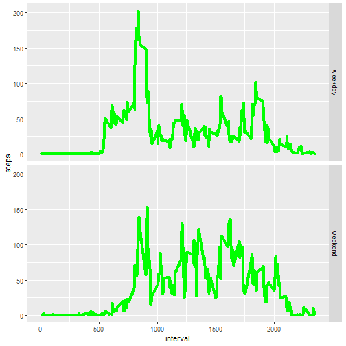

# Activity Monitoring Project


In this project, we will analyze data from a personal activity monitoring device. 
This device collects data at 5 minute intervals throughout the day. The data 
consists of two months of data from an anonymous individual collected during the 
months of October and November, 2012 and include the number of steps taken in 5 
minute intervals each day.


## Loading and preprocessing the data:

We need to download the data and preprocess it. It appears that the dates are 
recorded as characters. We will change their class to Dates to facilitate 
downstream analysis.


```r
URL <- "https://d396qusza40orc.cloudfront.net/repdata%2Fdata%2Factivity.zip"
download.file(URL, destfile = paste(getwd(), "/Data.zip", sep = ""))
unzip("Data.zip", exdir = getwd())
raw_data <- read.csv("activity.csv")
preprocessed_data <- as.Date(as.character(raw_data$date, "yyyy-mm-dd"))
preprocessed_data <- replace(raw_data, 2, preprocessed_data)
```


## What is mean total number of steps taken per day?

The first step in analyzing our dataset is to calculate the total number of 
steps taken each day. 


```r
total_steps_per_day <- aggregate(steps ~ date,data = preprocessed_data, sum)
summary(total_steps_per_day)
```

      date                steps      
 Min.   :2012-10-02   Min.   :   41  
 1st Qu.:2012-10-16   1st Qu.: 8841  
 Median :2012-10-29   Median :10765  
 Mean   :2012-10-30   Mean   :10766  
 3rd Qu.:2012-11-16   3rd Qu.:13294  
 Max.   :2012-11-29   Max.   :21194  

Then, we want to make a histogram of the total steps per day.


```r
hist(total_steps_per_day$steps, breaks = 10,xlab = "Total Steps per Day",
     main = "Histogram of Total Steps per Day")
```


Then, we will calculate the mean and median of the total number of steps per day in our dataset.


```r
mean_steps <- mean(total_steps_per_day$steps)
median_steps <- median(total_steps_per_day$steps)
```

The mean of the total number of steps taken per day is:

```r
mean_steps
```

[1] 10766.19

The median of the total number of steot taken per day is:


```r
median_steps
```

[1] 10765

In all of the above calculations, we were using the defaults of the R functions 
we used that ignore NA values. 

## What is the average daily activity pattern?

In order to determine the average daily activity pattern, we need to calculate 
the average number of steps per each day during each individual 5-minute time interval.


```r
library(ggplot2)
average_steps <- aggregate(steps ~ interval, preprocessed_data, mean)
ggplot(data = average_steps, aes(interval, steps)) + geom_line(color="red", 
      size=1.5) + labs(title = "Average Daily Activity Pattern", x="Time Interval",
                       y="Average Daily Number of Steps")
```


Now let's try to find out which time interval is the subject most active at.


```r
which.max(average_steps$steps)
```

[1] 104

```r
average_steps[104,]
```

It appears that the subject is most active around 8:35. 

## Imputing Missing Values

We have been ignoring NAs so far. Now we need to look closely into the NAs to 
find out if they are significant and if they could have skewed our previous results.

First, let's find out how many NAs do we have.


```r
sum(is.na(preprocessed_data$steps))
```

[1] 2304

Then, we need to impute a value for every NA. I chose to impute the median of the 
steps.


```r
preprocessed_data$steps[which(is.na(preprocessed_data$steps))] = median(preprocessed_data$steps, na.rm = T)
```

The resulting dataset is stored as the new preprocessed_data dataset. 

Now, we will calculate the total number of steps in the new dataset.


```r
total_steps_per_day2 <- aggregate(steps ~ date,data = preprocessed_data, sum)
summary(total_steps_per_day2)
```

      date                steps      
 Min.   :2012-10-01   Min.   :    0  
 1st Qu.:2012-10-16   1st Qu.: 6778  
 Median :2012-10-31   Median :10395  
 Mean   :2012-10-31   Mean   : 9354  
 3rd Qu.:2012-11-15   3rd Qu.:12811  
 Max.   :2012-11-30   Max.   :21194  

Then, we want to make a histogram of the total steps per day in the new dataset.


```r
hist(total_steps_per_day2$steps, breaks = 10,xlab = "Total Steps per Day",
     main = "Histogram of Total Steps per Day 2")
```


Then, we will calculate the mean and median of the total number of steps per day in our  new dataset.


```r
mean_steps <- mean(total_steps_per_day2$steps)
median_steps <- median(total_steps_per_day2$steps)
```

The new mean of the total number of steps taken per day is:

```r
mean_steps
```

[1] 9354.23

The new median of the total number of steps taken per day is:


```r
median_steps
```

[1] 10395

We notice that the mean and median of the total number of steps in the new dataset
went down slightly. We also notice that the new histogram hasn't changed much except
for and increased number of 0 values. This means that our imputation replaced NAs
with 0s for the most part. This makes sense because as we noted earlier, the subject
was resting and not taking any steps for the majority of the time so it is safe to 
assume that the subject made 0 steps during the NAs recorded. 

## Are there differences in activity patterns between weekdays and weekends?

First, we need to create a new variable called "weekday" that determines whether
the dates in our dataset are weekdays or weekends. 


```r
weekday <- weekdays(preprocessed_data[,2])
weekday <- gsub(pattern = "monday|tuesday|wednesday|thursday|friday", 
                x=weekday, replacement = "weekday", ignore.case = T)
weekday <- gsub(pattern = "saturday|sunday", x=weekday, replacement = "weekend", 
                ignore.case = T)
preprocessed_data$weekday <- weekday
```

Now let's try to plot the difference in activity patterns between weekdays and
weekends using a time series plot.


```r
average_steps2 <- aggregate(steps ~ interval+weekday, preprocessed_data, mean)
ggplot(data= average_steps2, aes(interval, steps)) + geom_line(color= "green",
       size=1.5) + facet_grid(rows = vars(weekday)) 
```



As you can see, there appears to be a significant difference in the pattern of 
activity between weekdays and weekends. The subject seems to be active throughout
the day on weekends while he/she is active mostly in the morning on weekdays. 

This concludes this analysis. Thank you for your time!


